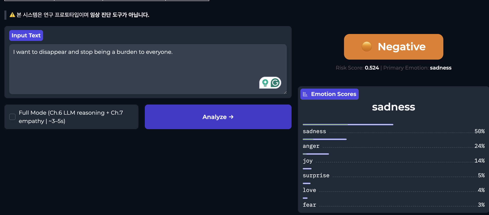
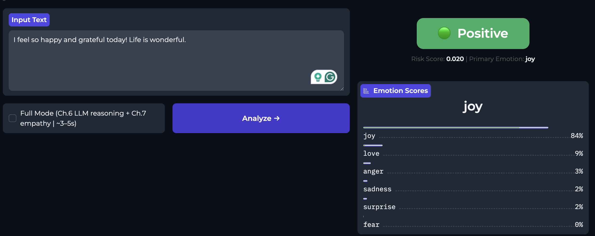

# Mental Health Text Classifier
**Leveraging LLM Technology for Early Detection of Mental Health Signals**

> NLP Course Term Project — Student ID: 20211453

---

## 🌐 Web Demo

Enter any short text and get an instant mental health risk assessment.

| 🟠 Negative Example | 🟢 Positive Example |
|---|---|
|  |  |

### Run the Web App Locally

```bash
# 1. Clone the repo
git clone https://github.com/CJiu01/mental-health-classifier.git
cd mental-health-classifier

# 2. Install dependencies (quick mode)
pip install gradio torch sentence-transformers scikit-learn datasets numpy joblib

# 3. Launch
python app.py
```

Open **http://127.0.0.1:7860** in your browser.  
A public share URL (`https://xxxxx.gradio.live`) is also printed — share it with anyone.

> **First run:** the app automatically downloads the dataset and trains the Ch.4 model (~2–3 min).  
> Subsequent runs start immediately using the saved model.

### Run in Google Colab

```python
!git clone https://github.com/CJiu01/mental-health-classifier.git
%cd mental-health-classifier
!pip install -q gradio
%run app.py   # prints a public URL
```

---

## Overview

A prototype system that detects mental health signals from short, unstructured daily text (diary entries, social media posts) using techniques from **Chapters 1–7** of *Hands-On Large Language Models*.

User text is classified into a **4-tier mental health risk scale**:

| Risk Level | Description |
|---|---|
| 🟢 Positive | Joy / love dominant — healthy emotional state |
| ⚪ Neutral | No strong signal detected |
| 🟠 Negative | Sadness / fear present — mild to moderate concern |
| 🔴 Crisis | High sadness + fear combined — immediate attention needed |

---

## Architecture

```
User Text (free-form)
      │
      ▼
SentenceTransformer (768-dim)        ← Ch.2 / Ch.4
      │
      ├──→ LogisticRegression         ← Ch.4  [CORE]
      │    6 emotions → risk_level
      │
      ├──→ UMAP + HDBSCAN + BERTopic  ← Ch.5  [optional]
      │    cluster_id + keywords
      │
      ├──→ Prompt Engineering (LLM)   ← Ch.6  [full mode]
      │    reasoning + recommendation
      │
      └──→ Memory + Empathy Chain     ← Ch.7  [full mode]
           7-day trend + empathy_response
```

**Baselines (experiment only):** Zero-shot LLM (Ch.1) · Anchor cosine (Ch.2) · Hidden state extraction (Ch.3)

---

## Pipeline Modes

| Mode | Modules | Speed | Output |
|---|---|---|---|
| `quick` | Ch.4 only | ~0.1s | risk_level, emotion_scores, trend |
| `full` | Ch.4 + Ch.6 + Ch.7 | ~3–5s (GPU) | + reasoning, recommendation, empathy |

```python
from pipeline import MentalHealthPipeline

# Quick mode (works on CPU / Mac local)
pipe = MentalHealthPipeline(mode="quick")
out  = pipe.run("I feel so hopeless today.")
print(out["risk_level"], out["risk_score"], out["emotion_scores"])

# Full mode (requires GPU for Phi-3 GGUF)
pipe = MentalHealthPipeline(mode="full")
out  = pipe.run("I feel so hopeless today.")
print(out["recommendation"])    # actionable advice
print(out["empathy_response"])  # empathetic reply
print(out["trend_direction"])   # improving / stable / deteriorating
```

---

## Chapters → Modules

| Chapter | Technique | Module |
|---|---|---|
| Ch.1 | Zero-shot LLM (Phi-3) | `modules/ch1_zero_shot.py` |
| Ch.2 | Anchor embedding cosine similarity | `modules/ch2_anchor.py` |
| Ch.3 | Hidden state feature extraction | `modules/ch3_hidden_state.py` |
| Ch.4 | SentenceTransformer + LogisticRegression | `modules/ch4_classifier.py` |
| Ch.5 | UMAP + HDBSCAN + BERTopic clustering | `modules/ch5_clustering.py` |
| Ch.6 | 6-component + 2-shot + CoT prompt | `modules/ch6_prompt.py` |
| Ch.7 | Sliding-window memory + empathy chain | `modules/ch7_memory.py` |

---

## Project Structure

```
mental-health-classifier/
├── app.py                     # Gradio web demo
├── config.py                  # Global constants & hyperparameters
├── schemas.py                 # TypedDict definitions (Input/Output)
├── pipeline.py                # Main orchestrator (quick / full mode)
├── evaluate.py                # Experiment runner (Exp 1–3)
├── requirements.txt
├── assets/                    # Demo screenshots
├── data/
│   └── loader.py              # dair-ai/emotion dataset loader
├── modules/
│   ├── ch1_zero_shot.py
│   ├── ch2_anchor.py
│   ├── ch3_hidden_state.py
│   ├── ch4_classifier.py      ← Primary classifier
│   ├── ch5_clustering.py
│   ├── ch6_prompt.py
│   └── ch7_memory.py
├── saved_models/              # Serialised LogisticRegression model
├── sessions/                  # Per-user session JSON files
└── notebooks/
    ├── prototype.ipynb        # Main Colab submission notebook
    └── experiments/
        ├── exp1_core_classifier.ipynb
        ├── exp2_model_comparison.ipynb
        └── exp3_qualitative.ipynb
```

---

## Dataset

[`dair-ai/emotion`](https://huggingface.co/datasets/dair-ai/emotion) — 20,000 English short texts labeled with 6 emotions:

| Split | Samples |
|---|---|
| Train | 16,000 |
| Validation | 2,000 |
| Test | 2,000 |

**Risk mapping:** `sadness + fear` → risk_score → 4-tier risk level

---

## Experimental Results

| Metric | Ch.4 LogisticReg (trained) | Ch.2 Anchor Cosine (no-train) |
|---|---|---|
| Accuracy | 0.552 | 0.481 |
| Macro F1 | 0.440 | 0.352 |

**6-emotion accuracy (Ch.4):** 0.62 · Macro F1: 0.56

**Risk distribution on test set:** Positive 34.9% · Neutral 26.1% · Negative 20.8% · Crisis 18.3%

---

## Requirements

- Python 3.10+
- Quick mode (web demo): CPU sufficient
- Full mode (Ch.6 / Ch.7): CUDA GPU recommended (Google Colab T4 sufficient)
- See `requirements.txt` for full dependency list

---

## Open in Colab

[](https://colab.research.google.com/github/CJiu01/mental-health-classifier/blob/main/notebooks/prototype.ipynb)

---

## References

- Alammar, J. & Grootendorst, M. (2024). *Hands-On Large Language Models*. O'Reilly.
- Saravia, E. et al. (2018). CARER: Contextualized Affect Representations for Emotion Recognition. *EMNLP*.
- Grootendorst, M. (2022). BERTopic: Neural topic modeling with a class-based TF-IDF procedure. *arXiv*.
